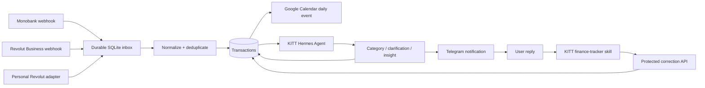

# LeGrin Finance Pipeline

Надійний pipeline для особистих фінансів:



## Що вже реалізовано

- Monobank webhook із суворою швидкою відповіддю `200`, deduplication і durable processing.
- Revolut Business webhooks `TransactionCreated` та `TransactionStateChanged` із HMAC SHA-256 перевіркою exact raw payload, timestamp tolerance та захистом від out-of-order regression.
- Нормалізований endpoint для окремого Personal Revolut adapter/aggregator.
- SQLite WAL ledger, durable inbox/outbox, retry/backoff і відновлення завислих `processing` jobs після crash.
- Один all-day Google Calendar event на день, який оновлюється після кожного руху коштів.
- Daily budget signals `⚪ 🟢 🟡 🔴`, список рухів та місячні підсумки категорій у Calendar.
- Категоризація через rules, MCC, історію та KITT Hermes Agent `/v1/chat/completions`.
- Hermes використовується для класифікації, але user-visible повідомлення та інсайти будуються лише з перевірених ledger totals і merchant frequency, щоб модель не вигадувала факти.
- Якщо confidence низький, Telegram повідомлення містить коротке питання й transaction ID.
- Персональні інсайти за частотою merchant, наприклад повторні покупки у Mlinar.
- Protected API для KITT: unresolved transactions, ручна категоризація, category memory та monthly summary.
- Docker Compose, Caddy example, Monobank registration script і готовий KITT `finance-tracker` skill.

Requirement-by-requirement local and live-KITT acceptance evidence: [`docs/acceptance-2026-08-11.md`](docs/acceptance-2026-08-11.md).

Production CI/CD, live topology, and Monobank activation runbook: [`deploy/CICD.md`](deploy/CICD.md).

## Важливе обмеження Revolut

Публічні first-party webhooks доступні для **Revolut Business API**. Revolut не надає простого публічного API/webhook для звичайного Personal account.

Для Personal Revolut використовуйте один із варіантів:

1. **Рекомендований MVP:** завантажувати CSV-виписку в Telegram. KITT передає оригінальний файл у deterministic importer сервісу.
2. Регульований Open Banking provider або aggregator, який надсилає нормалізовані транзакції у `POST /webhooks/revolut/personal/:secret`.
3. Власний дозволений adapter, який отримує дані з легального джерела й викликає той самий endpoint.

Не використовуйте browser scraping банкінгу або неофіційне зберігання login/password.

Це рішення повторно перевірено за офіційною документацією Revolut: Business API призначений для Business Account, а production Open Banking потребує TPP-style consent flow і валідний OBIE/eIDAS transport certificate. Деталі та критерії переходу з CSV на автоматичний provider: [`docs/revolut-personal-strategy.md`](docs/revolut-personal-strategy.md).

## Швидкий локальний запуск

Потрібен Node.js `>=22.13`, рекомендовано Node 24.

```bash
cp .env.example .env
npm install
npm run check
npm run dev
```

Мінімально обов'язкові значення:

```dotenv
WEBHOOK_SHARED_SECRET=<random 32+ bytes>
INTERNAL_API_TOKEN=<different random 32+ bytes>
```

Генерація:

```bash
openssl rand -hex 32
openssl rand -hex 32
```

Health check:

```bash
curl http://127.0.0.1:8088/health
```

## VPS deployment

```bash
cp .env.example .env
mkdir -p data secrets
docker network create legrin_default 2>/dev/null || true
docker compose up -d --build
docker compose ps
```

Сервіс слухає лише `127.0.0.1:${FINANCE_PORT:-18088}` на host. Опублікуйте його через HTTPS reverse proxy. Приклад: [`deploy/Caddyfile.example`](deploy/Caddyfile.example).

Не вмикайте access logs із повними webhook URL, бо Monobank secret знаходиться у path.

## Monobank

1. Додайте `MONOBANK_TOKEN` і `PUBLIC_BASE_URL` у `.env`.
2. Переконайтеся, що HTTPS endpoint доступний з інтернету.
3. Зареєструйте webhook:

```bash
npm run register:monobank
```

Endpoint:

```text
GET|POST /webhooks/monobank/:secret
```

## Revolut Business

У Revolut Developer Portal зареєструйте:

```text
POST https://finance.example.com/webhooks/revolut/business/:secret
```

У `.env` встановіть webhook signing secret:

```dotenv
REVOLUT_WEBHOOK_SIGNING_SECRET=...
```

Webhook duplicate та out-of-order delivery обробляються. Для повної production reconciliation бажано додати окремий scheduled pull із Revolut Business API як authoritative repair path.

## Personal Revolut adapter contract

### CSV statement через Telegram/KITT

Експортуйте CSV у Revolut і надішліть його KITT. Skill не просить LLM парсити фінансові рядки, а передає файл байт-в-байт:

```http
POST /api/import/revolut/csv?account_id=revolut-personal
Authorization: Bearer INTERNAL_API_TOKEN
Content-Type: text/csv
```

Importer підтримує стандартні колонки Revolut `Type`, `Product`, `Started Date`, `Completed Date`, `Description`, `Amount`, `Fee`, `Currency`, `State`, `Balance`. Він:

- створює stable transaction IDs без банківського transaction ID у CSV;
- не дублює рядки при повторному завантаженні;
- оновлює pending → completed при новішій виписці;
- обліковує fee окремим рухом у категорії `Fees`;
- відправляє імпортовані транзакції у той самий Calendar/KITT pipeline.

CSV кращий за PDF. PDF parsing через LLM може переплутати знак, валюту, дату або пропустити рядок, тому PDF не імпортується автоматично.

### Нормалізований adapter endpoint

Protected shared-secret endpoint:

```http
POST /webhooks/revolut/personal/:secret
Content-Type: application/json
```

```json
{
  "id": "provider-transaction-id",
  "accountId": "personal-eur",
  "occurredAt": "2026-08-11T08:30:00.000Z",
  "updatedAt": "2026-08-11T08:31:00.000Z",
  "description": "MLINAR CENTAR",
  "merchant": "Mlinar",
  "amount": -8.5,
  "currency": "EUR",
  "status": "completed",
  "kind": "expense",
  "mcc": 5812
}
```

Adapter має повторювати delivery при non-2xx та надсилати стабільний `id`.

## Google Calendar

1. Створіть Google Cloud service account і ввімкніть Calendar API.
2. Поділіться потрібним календарем з email service account із правом редагування.
3. Покладіть JSON у `secrets/google-service-account.json`.
4. Встановіть `GOOGLE_CALENDAR_ID`.

На `legrin-main` можна не створювати окремий service account. Pipeline також підтримує вже розгорнутий `google-sidecar`, який зберігає user OAuth tokens. Для цього встановіть `GOOGLE_SIDECAR_URL`, `GOOGLE_SIDECAR_TOKEN` і `GOOGLE_SIDECAR_USER_ID`; Calendar ID старого finance-календаря можна залишити тим самим.

Звичайний Google API key сам по собі не дає права записувати у приватний календар. Для цього потрібен OAuth access або service account JSON, а календар треба явно share-нути з service account email.

Нові event IDs детерміновані за датою, що запобігає дублюванню при crash між Google insert і локальним commit.

## KITT Hermes Agent

Pipeline викликає:

```text
POST http://kitt-hermes:8080/v1/chat/completions
Authorization: Bearer HERMES_AGENT_KEY
```

Встановіть:

```dotenv
HERMES_AGENT_URL=http://kitt-hermes:8080
HERMES_AGENT_KEY=<same value as KITT HERMES_KEY/API_SERVER_KEY>
```

Скопіюйте [`integrations/kitt/finance-tracker`](integrations/kitt/finance-tracker) до KITT skills та додайте KITT container env згідно з [`integrations/kitt/README.md`](integrations/kitt/README.md). Skill дозволяє KITT записати відповідь користувача назад у ledger і запам'ятати merchant category.

## Telegram

Pipeline сам надсилає outbound повідомлення через Telegram Bot API. Це дозволяє KITT зосередитися на аналізі й не робити tool calls під час webhook request.

```dotenv
TELEGRAM_BOT_TOKEN=...
TELEGRAM_CHAT_ID=...
```

Якщо використовується той самий bot, через який користувач спілкується з KITT, KITT отримає відповідь користувача і застосує `finance-tracker` skill.

## Protected API

Усі `/api/*` endpoints потребують:

```http
Authorization: Bearer INTERNAL_API_TOKEN
```

| Method | Endpoint | Призначення |
|---|---|---|
| `GET` | `/api/transactions?needs_review=true` | Невизначені витрати |
| `GET` | `/api/transactions/:id` | Одна транзакція |
| `POST` | `/api/import/revolut/csv` | Ідемпотентний CSV import Personal Revolut |
| `PATCH` | `/api/transactions/:id/category` | Категорія та merchant memory |
| `GET` | `/api/summary/month?month=YYYY-MM` | Місячний summary |
| `POST` | `/api/admin/retry-failed` | Повторити failed inbox/outbox jobs |
| `POST` | `/api/admin/sync-budget` | Повторно віддзеркалити всі транзакції у Budget app |
| `POST` | `/api/admin/sync-calendar` | Повторно синхронізувати кожну дату з транзакціями у Calendar |

Correction body:

```json
{
  "category": "Restaurants & coffee",
  "remember": true
}
```

## Надійність і семантика

- Webhook payload durable-зберігається до запуску важкої роботи.
- Deduplication keys роблять повторну доставку безпечною.
- Один worker на SQLite database. Не запускайте кілька replicas над одним bind-mounted DB.
- Calendar delivery і Telegram мають retry. Telegram API не підтримує idempotency key, тому після crash у вузькому вікні можлива повторна нотифікація.
- Різні currencies не конвертуються й підсумовуються окремо.
- Грошові значення зберігаються integer minor units із ISO 4217 exponent.

## Security migration

Старий репозиторій містив committed TLS private key, Google OAuth credentials і IFTTT key. Вони видалені з поточного дерева, але залишаються в Git history.

Перед production deployment обов'язково:

1. Відкликати й перевипустити старі Google OAuth credentials.
2. Замінити старий TLS key/certificate.
3. Відкликати старий IFTTT key.
4. За потреби очистити Git history через `git filter-repo`, окремо узгодивши force-push з усіма користувачами репозиторію.

Архів старої реалізації залишено у `legacy/` лише для історичного контексту.

## Перевірка

```bash
npm run check
npm run build
```

Test suite покриває Monobank normalization/deduplication, Personal Revolut normalization, офіційний Revolut HMAC vector, ISO currency exponents, crash recovery, out-of-order status protection, end-to-end SQLite pipeline, Calendar rendering та protected HTTP API.
