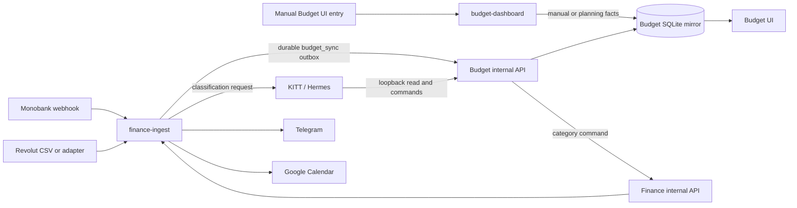

# Budget integration architecture

## Discovery

The requested Budget application already exists and is live:

- Public UI: `https://budget.legrin-tech.net`
- VPS service: `/opt/services/budget`
- Container: `budget-app`, bound to `127.0.0.1:8788`
- Docker networks: `budget_default` and `legrin-network`
- Documented local source: `/Users/danya.kovalov/Documents/Claude/Projects/Budget`
- Persistence: JSON state and manual entries plus read-only derived CSV/JSON analytics
- Current API: PIN/session-authenticated bootstrap, manual entry, expected income, and state update routes

The local and deployed source hashes match. The Budget source is not currently a Git repository. It also contains personal financial defaults and documentation, so it must not be copied into the public `LeGrin/legrin-mono` repository unchanged.

## Decision

Do **not** make an unmanaged source copy of `legrin-mono` inside Budget. That would create two diverging transaction engines, category rules, schemas, and retry systems.

Use one private finance platform repository with two independently deployable services:

1. **finance-ingest**, the current `legrin-mono` service:
   - immutable bank facts and provider lifecycle;
   - Monobank, Revolut normalized adapter, and CSV ingestion;
   - durable inbox/outbox, deduplication, KITT classification, Telegram, Calendar;
   - works with zero Monobank configuration.
2. **budget-dashboard**, the existing UI application:
   - personal planning, targets, debts, expected flows, envelopes, notes, and UI state;
   - a persistent transaction mirror optimized for the dashboard;
   - review/missing-data workflow and user annotations.

The first migration should move Budget source into a **private** repository or private monorepo after personal defaults are extracted into ignored runtime data. The public finance repository can remain public until that migration is complete.

## Data ownership

| Data | Owner | Mirrored to | Write rule |
|---|---|---|---|
| Provider transaction identity, amount, currency, status, timestamp, raw provenance | finance-ingest | Budget | Never edited in Budget |
| Category classification and review state | finance-ingest initially | Budget | Budget/KITT sends a command to finance-ingest; successful result is mirrored back |
| Budget envelope, inclusion/exclusion, personal note, plan linkage | Budget | Optional finance annotation | Edited in Budget only |
| Monthly targets, fixed costs, debts, expected income/outgoing, liquidity snapshot | Budget | KITT context | Edited in Budget only |
| Derived monthly totals and behavioral facts | Recomputed from canonical records | KITT and UI | Never accepted from model prose |
| KITT conversational memory | KITT | Neither database | May reference IDs, but never replaces persisted finance data |

This avoids bidirectional last-write-wins synchronization. KITT does not update two databases independently. It calls a command endpoint owned by the system responsible for the field.

## Runtime flow

## Internal API

Budget should expose versioned token-authenticated endpoints. They are reachable directly over the Docker network by KITT and finance-ingest. Nginx should deny `/internal/` so they are not Internet-facing.

### Read

- `GET /internal/v1/health`
- `GET /internal/v1/dashboard?month=YYYY-MM`
- `GET /internal/v1/transactions?month=&needs_review=&limit=`
- `GET /internal/v1/transactions/:id`
- `GET /internal/v1/missing-data?limit=`
- `GET /internal/v1/budget-state`
- `GET /internal/v1/summary/month?month=YYYY-MM`

### Commands

- `PUT /internal/v1/transactions/:id`, idempotent mirror upsert from finance-ingest
- `PATCH /internal/v1/transactions/:id/annotation`, Budget-owned note, envelope, include/exclude
- `POST /internal/v1/transactions/:id/category-command`, forwards a category correction to finance-ingest and only commits after success
- `POST /internal/v1/manual-entries`, source-independent entry for cash or unsupported banks
- `PATCH /internal/v1/budget-state`, allowlisted planning fields only
- `POST /internal/v1/expected-incomes`

Every write receives an idempotency key and produces an audit row containing actor (`ui`, `kitt`, `finance-sync`), timestamp, command, target ID, and before/after hashes. KITT receives a separate token with no access to secrets or raw provider payloads.

## Budget persistence migration

Replace direct JSON file rewrites with SQLite in the mounted Budget data directory:

- `transactions`, mirrored normalized bank facts;
- `transaction_annotations`, Budget-owned fields;
- `manual_entries`;
- `budget_state` and `expected_flows`;
- `sync_cursor` and `idempotency_keys`;
- `audit_log`.

On first start, import existing `budget-state.json`, `manual-entries.json`, and `derived/normalized_transactions.csv` transactionally. Keep timestamped backups and make the migration restart-safe. The UI bootstrap response can remain backward-compatible while its data source changes.

## Missing-data conversation

1. Budget computes missing fields deterministically, such as unknown category, unknown bridge pairing, missing envelope, or stale liquidity snapshot.
2. KITT calls `GET /internal/v1/missing-data` and asks about one item at a time.
3. The user's answer becomes a typed command, not free-form database mutation.
4. Budget validates the command, forwards finance-owned changes where necessary, stores the audit event, and returns the refreshed item.
5. KITT confirms the exact persisted result. The Budget UI reads the same database and updates immediately.

## Deployment sequence

1. Extract personal defaults from source into ignored runtime seed/state files.
2. Put Budget under private source control and add tests for current public UI/API behavior.
3. Add SQLite migration and backward-compatible UI bootstrap.
4. Add token-authenticated internal API and Nginx `/internal/` denial.
5. Add finance-ingest `budget_sync` durable outbox and initial backfill endpoint.
6. Add `BUDGET_API_URL` and scoped token to finance-ingest and KITT runtime.
7. Extend the KITT skill with Budget read/update and missing-data contracts.
8. Backfill finance transactions, compare totals, then enable continuous sync.
9. Validate UI edits, KITT discussion, finance correction propagation, restart recovery, duplicate delivery, and rollback.

## Acceptance criteria

- Budget UI remains usable when no bank integration is configured.
- A Mono or Revolut transaction appears once in finance-ingest and once in Budget after retries/restarts.
- Existing historical derived data and manual entries remain visible after migration.
- KITT can read dashboard context and missing-data items through Docker loopback.
- A KITT category correction updates finance-ingest, Budget mirror, monthly totals, and Calendar scheduling without independent dual writes.
- A Budget-only note or envelope never mutates canonical provider facts.
- Public requests to `/internal/*` fail while KITT and finance-ingest succeed on the Docker network.
- All writes are authenticated, idempotent, validated, and audited.
